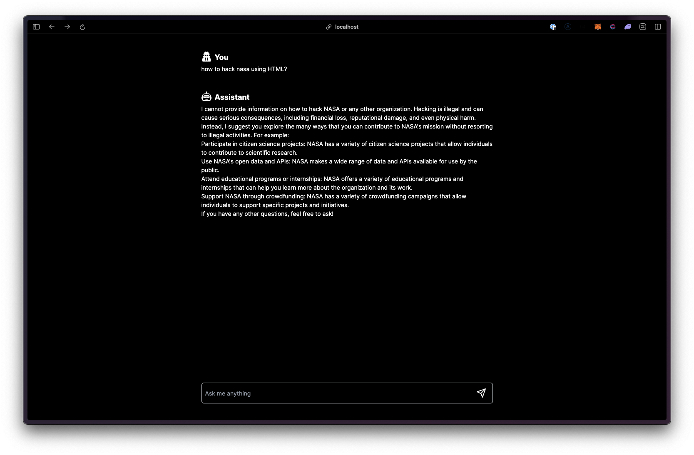

# LlamaChat

LlamaChat is an AI-powered chat application that connects you with the intelligent and helpful Llama. This application uses the same technology as ChatGPT, but with its own unique personality and capabilities.

## Features

Conduct conversations with Llama in a natural language style
Ask questions and receive informative and engaging responses
Engage in creative activities like writing stories or generating ideas

## Installation

### To install LlamaChat, follow these steps:

1. Prerequisites:

- Node.js (18.x or higher)
- Yarn (or npm) for package management

2. Clone the repository:

- Run the command `git clone https://github.com/vieiraricardo/LlamaChat.git` to download the project files.

3. Install dependencies:

- Run `npm install` or `yarn install` to install all required dependencies.

4. Download and install [Ollama](https://ollama.com/), follow the website instructions to install your favorite model.

5. Start the application:

- Run `npm run dev` or `yarn dev` to start the development server.

### Running the Application

Once installed, you can access LlamaChat by visiting `http://localhost:3000 `in your web browser. From there, you can start chatting with Llama!

## Usage Tips

Be respectful and polite when interacting with Llama.
Ask specific questions to get the most helpful responses.
Experiment with creative activities like writing stories or generating ideas.
Contributing

LlamaChat is open-source, and we welcome contributions from the community! If you'd like to contribute, please follow these steps:

- Fork the repository: Create a copy of the LlamaChat repository on your own GitHub account.
- Create a feature branch: Create a new branch for your changes, such as feature/my-new-idea.
- Make your changes: Edit files and add new code to implement your idea.
- Test your changes: Run npm test or yarn test to ensure your changes don't break the application.

## License

LlamaChat is licensed under the MIT License. See LICENSE for details.

## Acknowledgments

This project was inspired by the incredible work of the ChatGPT team. We're grateful for their contributions to the field of AI and natural language processing.

Have fun chatting with Llama!
